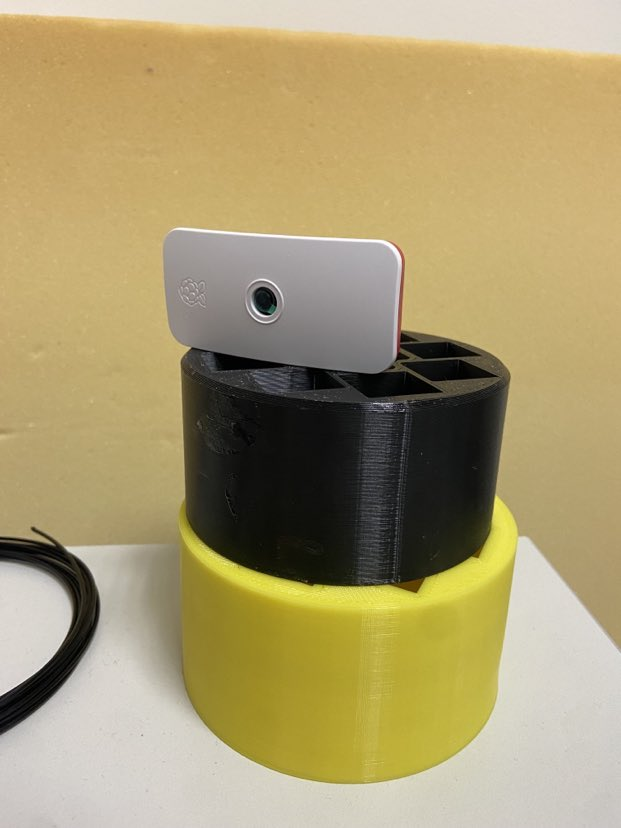
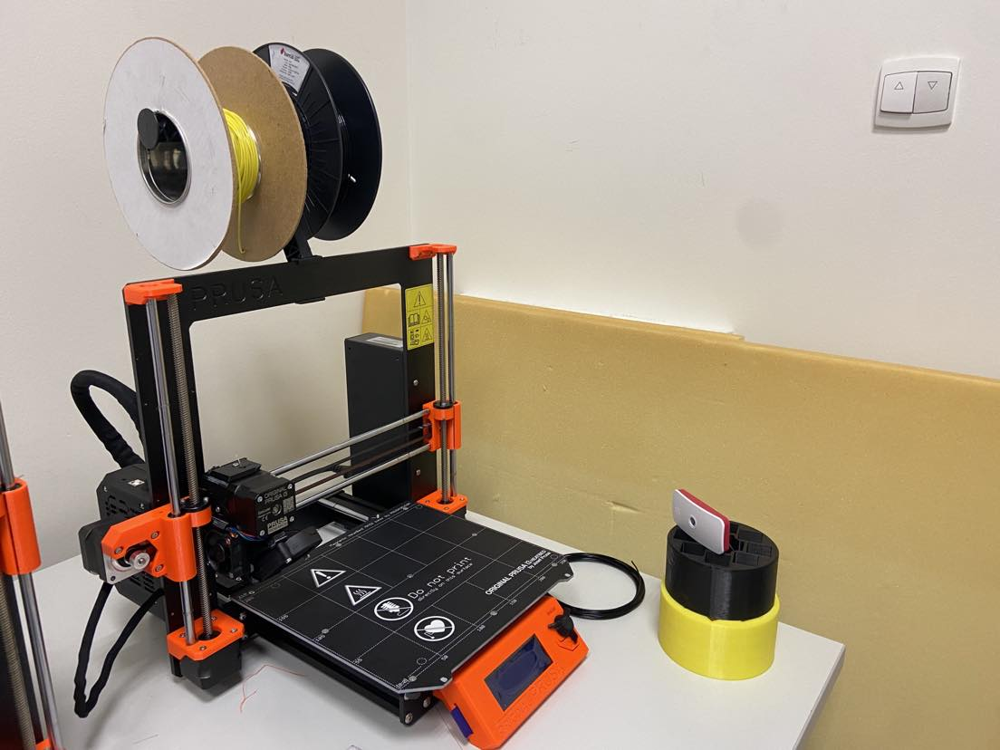
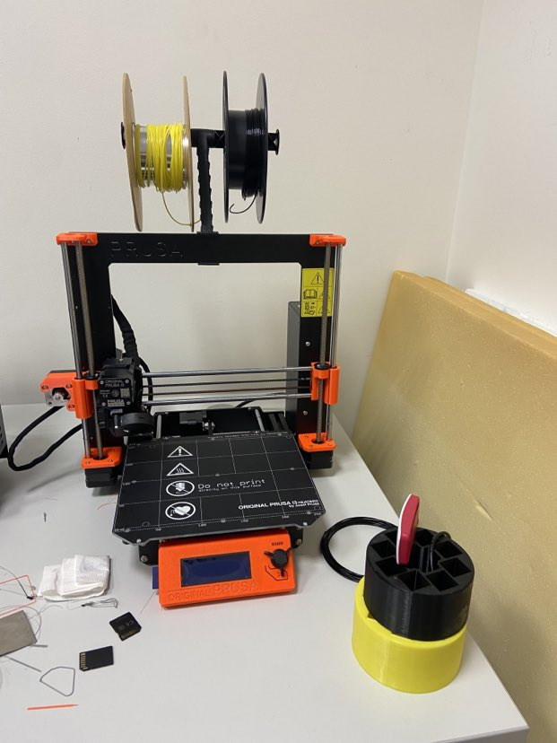

# Remote camera for 3D printer
# Authors 
- Wiktor Zantowicz
# Description of the project 
This project focuses on creating a 3D printer monitoring system with a Raspberry Pi-based camera. This setup provides convenience and flexibility for users to oversee their 3D printing projects from anywhere. 

# Science and tech used 
Parts and software used in this project:
- Raspberry Pi Zero: Core hardware running OctoPrint and camera
- Raspberry Pi Camera: dedicated camera for real-time monitoring
- Raspberry Pi Zero case
- OctoPrint: An open-source 3D printer control software that supports webcam integration.
- octoeverywhere.com: The chosen platform for remote access, offering a user-friendly interface for camera feed access.

# State of the art 
I used OctoPrint as the camera management system. It allows for remote access in LAN, but in an academic network, such connections are typically blocked by default. Because of this, I decided to utilize octoeverywhere.com as the server. As a result, anyone with access to the account can monitor the 3D print from anywhere. A free account allows for 30 seconds of viewing, after which the page needs to be refreshed.

The recommended Raspberry Pi for OctoPrint is the 3rd version, but for this project, a Raspberry Pi Zero is sufficient because we are not utilizing the full capabilities of OctoPrint.

It was necessary to add file wpa_supplicant.conf with WiFi ssid and name to connect without using gui mode.

To use the system, all that's needed is the login and password available in the Complexity Garage.

# What next?

One possible project expansion is to connect the Raspberry Pi to the 3D printer. This would enable remote control of the printing process, such as starting, stopping, and uploading files online. It would require a more powerful version of the Raspberry Pi.

Regarding the system, there are two options:
- Purchase a premium account on octoeverywhere.com.
- Have the ability to influence the print only from the Complexity Garage network.
# Sources 
- [Writing on GitHub] ( https://docs.github.com/en/get-started/writing-on-github )
- [OctoPrint tutorial] (https://help.prusa3d.com/pl/article/octoprint-konfiguracja-i-instalacja_2182?gad=1&gclid=CjwKCAjwyNSoBhA9EiwA5aYlb_6o3jeAFQktKI3kfejXJd_tv1Poi1pCg0KKQdAtwdNwpkhr9EIfXRoC7RkQAvD_BwE)
- [OctoEverywhere.com] (https://plugins.octoprint.org/plugins/octoeverywhere/)
